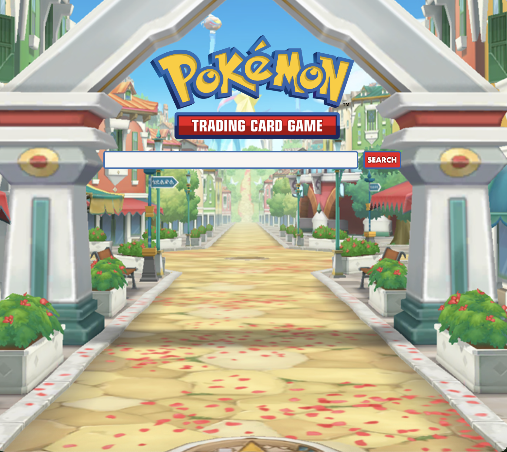

Pokemon Card Lookup

This project utilizes the pokemon trading card game api to access all the cards pokemon has ever dropped to look up your favorite cards and discover new ones. It allows you to search pokemon by name to show you all the cards ever released.

Link to project: https://dylanferger.github.io/PokemonTCG-Lookup-App/index.html


How It's Made:

Tech used: HTML, CSS, JavaScript

For this website I began by creating a fetch for the pokemon trading card game api. I just wanted to pratice appending the card images to the DOM. Once i figured that out I thought it was really cool and decided to keep going with it. I created a home screen with an input and submit button, then added the logo and background. Once it was done I created a search page that ran the fetch funtions to append the card images to it. After this I had to figure out how to correctly add the images to the right section on the page and used css to order them properly. The next step wa to turn that function into one that took in the value applied to the input on the home page and search the pokemon api to append all the pokemon matching that search. This took awhile to accomplish because I had never done something like this before. I searched around and tried multiple options that didn't seem to work corectly. I finally found a post about adding the input to local storage to allow use of it on the next page. This worked perfectly and seemed like such a simple way to solve a problem I imagined to be a lot more complex.

Optimizations:
I still plan to come back to this project once I learn a little more and update the fetch functions to split the images into multiple pages. When you search a pokemon with a ton of cards (ex: pikachu) it takes the api quite a bit of time to append all of the images to the DOM. I believe that appending the images to multiple pages with 30 on each page would create a lot faster load times and make the website look a lot more professional.

Lessons Learned:
This project taught me a lot about using api's to fetch information and append it to the dom via javascript. I also learned how to take in inputs and transfer them to another page to run functions using that info. It was fun to finally see everything come together and work out. 

Examples:

Take a look at these couple examples that I have in my own portfolio:
Tommy's Portfolio V1 : https://github.com/DylanFerger/Tommy-Website
